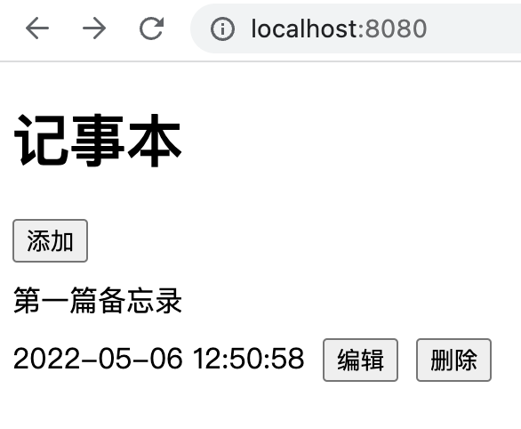

# 记事本
主要是为学习如何用Rust写前端而创建的，框架用的是[Yew](https://yew.rs)，存储使用[IndexedDB](https://developer.mozilla.org/zh-CN/docs/Web/API/IndexedDB_API)。目前实现了基本的数据存储以及显示功能，难点部分基本已经解决，目前这方便的资料比较少，希望大家不要重复踩坑，相互学习。

Yew的中文文档跟英文有出入，建议以英文的为主。

运行

```sh
trunk serve
```


